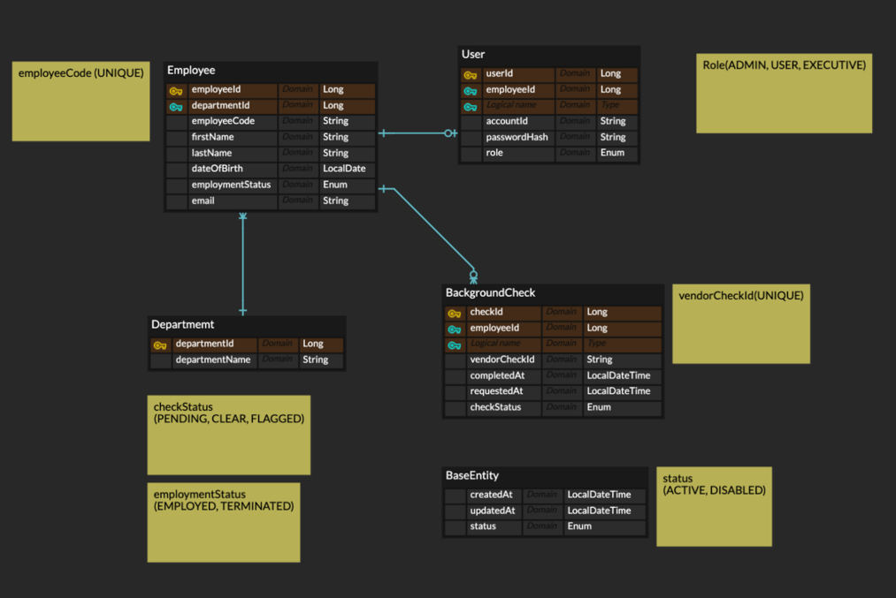
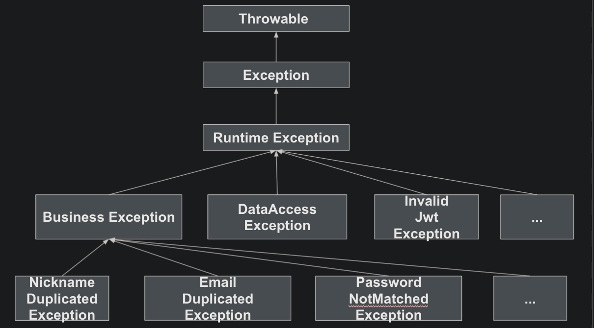

# Internal Employee Portal

#### 서비스 url
http://ec2-13-209-159-253.ap-northeast-2.compute.amazonaws.com:8080/html/login.html

#### API 문서(Swagger)
http://ec2-13-209-159-253.ap-northeast-2.compute.amazonaws.com:8080/swagger-ui.html

## 1. 프로젝트 개요

사내 직원 관리 시스템(Internal Employee Portal)으로, 직원용 포털과 관리자용 대시보드를 구분하여 구현했습니다.

- 직원(User)은 자신의 인적사항을 조회 및 수정할 수 있습니다.
- 관리자(Admin)는 직원 계정 생성, 직원 목록 조회, 직원 상세 조회, 퇴사 처리, Background Check 요청 및 결과 조회 기능을 수행할 수 있습니다.
- 외부 Background Check API를 연동하여 직원의 배경 조회 요청 및 결과 관리를 지원합니다.

---

## 2. 기술 스택

- **Backend** : Spring Boot, Spring Security, Spring Data JPA
- **Database** : MySQL
- **Authentication** : JWT (Access Token / Refresh Token)
- **Infra** : AWS EC2, AWS RDS
- **API Documentation** : Swagger (SpringDoc)
- **External Integration** : Background Check API

---

## 3. DB 설계

주요 도메인은 다음과 같이 구성했습니다.

- `User`
- `Employee`
- `Department`
- `BackgroundCheck`

#### 3.1 User / Employee 분리 설계
- `User`는 **로그인 계정 및 권한(Role)** 을 관리합니다.
  - Role에 따라 필터에서 접근 권한을 제어할 수 있도록 설계했습니다.
- `Employee`는 **직원 인적 정보 및 재직 상태**를 관리합니다.
- 인증 정보와 직원 프로필 정보를 분리함으로써 보안과 데이터 관리 측면에서 유연성을 확보했습니다.

#### 3.2 Employee 식별자
- 내부 식별자는 `Long PK`를 사용합니다.
- 업무 식별용으로 `employeeCode (EMP-YYYY-001)`을 별도로 사용함으로써 Background Check API와의 호환성을 유지했습니다.

#### 3.3 BackgroundCheck 설계
- 한 직원에 대해 여러 Background Check 요청이 발생할 수 있으므로 `Employee`와 `BackgroundCheck`는 1:N 관계로 설계했습니다.
- Background Check 요청 시 `status` 필드를 통해 진행 상태를 관리합니다.

#### 3.4 Background Check 개별 저장
- Background Check API에서 반환된 결과는 `BackgroundCheck` 엔티티에 개별적으로 저장됩니다.
- 이를 통해 각 요청의 결과를 독립적으로 관리할 수 있으며, 과거 요청 이력도 쉽게 조회할 수 있습니다.


## 4. 로그인 및 JWT 인증을 통한 권한 관리
본 시스템은 Spring Security와 JWT를 사용하여 인증(Authentication)과 인가(Authorization)를 구현했습니다.

#### 4.1 로그인 및 토큰 발급
- 사용자는 `accountId`와 `password`를 통해 로그인합니다.
- `PasswordEncoder`를 사용하여 암호화된 비밀번호를 검증합니다.
- 로그인 성공 시 **Access Token**과 **Refresh Token**을 발급합니다.

#### 4.2 JWT 기반 인증 처리
요청이 들어오면 `CustomOncePerRequestFilter`에서 JWT를 검증합니다.

처리 흐름은 다음과 같습니다.
1. `Authorization` 헤더에서 Bearer Token 추출
2. JWT 서명 및 만료 여부 검증
3. 토큰에서 `accountId` 추출
4. 사용자 정보를 조회하여 `Authentication` 객체 생성
5. `SecurityContext`에 인증 정보 저장

또한 퇴사 처리된 직원은 필터 단계에서 검증하여 **기존 토큰이 있어도 즉시 접근이 차단**되도록 설계했습니다.

#### 4.3 역할 기반 접근 제어
인가 처리는 두 가지 방식으로 적용했습니다.
- **SecurityConfig**에서 URL 패턴 기반 권한 설정
    - `/auth/**` : 모두 허용
    - `/admin/**` : ADMIN 권한
    - `/api/v1/**` : USER 권한

- `@PreAuthorize`를 사용해 메서드 단위에서 추가 권한 검증
```java
@PreAuthorize("hasRole('ADMIN')");
```

## 5. 예외처리 및 응답 구조

- `GlobalExceptionHandler` 통해 모든 예외를 일관된 형식으로 처리
- API 응답은 `ApiResponse` 객체로 래핑하여 상태 코드, 메시지, 데이터 필드를 포함하도록 설계했습니다.
- 도메인 서비스 계층 기준으로 자주 쓰이는 비즈니스 예외 패턴을 정의하여 재사용성을 높였습니다.
- `ErrorCode` enum을 통해 예외 유형과 메시지를 중앙에서 관리하여 유지보수성을 향상시켰습니다.
```java
ACCOUNT_DISABLED(403, "E010", "사용이 불가한 계정입니다."),
ACCOUNT_ID_ALREADY_EXISTS(409, "E011", "이미 존재하는 계정 ID입니다."),

USER_DUPLICATE(409, "USR002", "이미 존재하는 사용자입니다."),
USER_NOT_FOUND(404, "USR001", "해당 사용자를 찾을 수 없습니다."),
  
LOGIN_FAILED(400, "USR003", "로그인에 실패하였습니다. 아이디와 비밀번호를 확인해주세요."),
LOGOUT_FAILED(400, "USR004", "로그아웃에 실패하였습니다. 다시 시도해주세요."),
```

## 6. Background Check API 연동
#### 6.1 API 연동 설계
- 직원이 배경 조회를 요청하면 `BackgroundCheckService`에서 API 호출을 수행
- API 응답을 `BackgroundCheck` 엔티티에 저장하여 결과 관리
- 관리자 대시보드에서 배경 조회 결과를 조회할 때 `BackgroundCheck` 엔티티에서 데이터를 조회하여 응답
- API 호출 실패 시 예외 처리를 통해 사용자에게 적절한 오류 메시지 반환

#### 6.2 중복되는 Background Check 요청 처리
- 동일 직원에 대해 이미 진행 중인 배경 조회 요청이 있는 경우, 새로운 요청이 들어오면 기존 요청의 상태를 확인하여 중복 요청을 방지
- 이미 진행 중인 요청이 있다면 기존의 요청을 취소하고 새로운 요청을 생성하는 방식으로 처리하여 최신 상태를 유지하도록 설계했습니다.
- 이전에 완료된 배경 조회 내역들을 조회할 수 있도록 `BackgroundCheck` 엔티티에 `employeeCode`와 `status` 필드를 활용하여 과거 요청 이력도 관리할 수 있도록 했습니다.